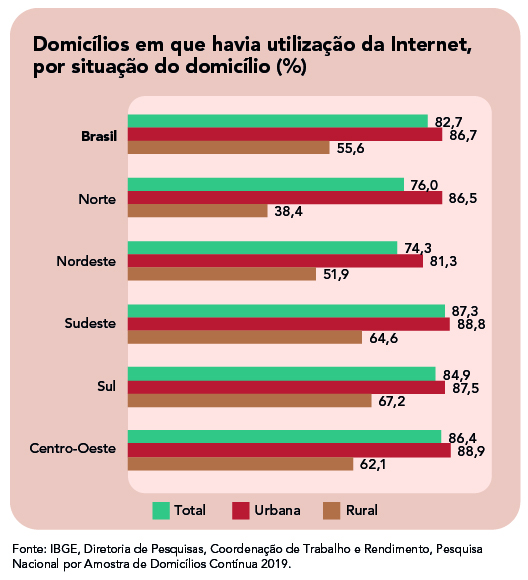
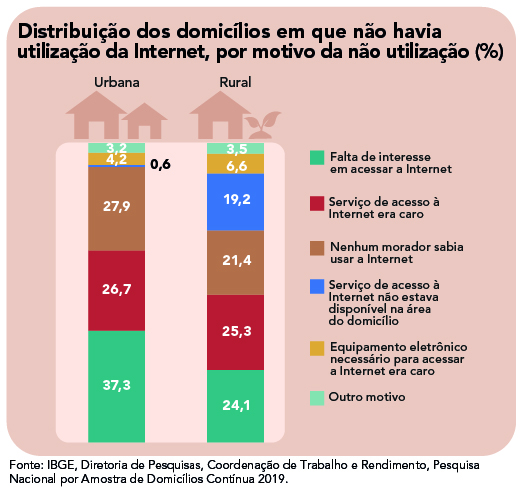

# AID-UNIPE

**APRESENTAÇÃO DO PROJETO: APOIO À INCLUSÃO DIGITAL DO CENTRO UNIVERSITÁRIO DE JOÃO PESSOA.**

## Sumário

1. [Quem somos](#1-quem-somos)
2. [Missão e visão](#2-missão-e-visão)
3. [Inclusão digital](#3-inclusão-digital)
4. [O acesso a computadores no Brasil](#4-o-acesso-a-computadores-e-internet-no-brasil)
5. [Resíduos eletroeletrônicos](#5-resíduos-eletroeletrônicos)
6. [Novo marco regulatório brasileiro](#6-novo-marco-regulatório-brasileiro)
7. [Onde estamos](#7-onde-estamos)
8. [Fale conosco](#8-fale-conosco)

## 1. Quem somos

**Coordenação**
* UBTECH TI

**Docente coordenador**

* Prof. Me. Viviano de Sousa Medeiros

**Discentes Coordenadores**

* José Lopes Sobrinho Neto
* Vinícius B. C. Centurion

**Discentes Estágiários e Voluntários**

O projeto tem como objetivo capacitar os discentes estagiários e voluntários em montagem e manuteção de computadores para que possam auxiliar na reciclagem, reutilização e doação dos equipamentos recuperados à comunidade. Também visa incentivar a conscientização da coleta e descarte adequado de equipamentos de computação (e demais eletroeletrônicos), estabelecendo parcerias com Empresas Privadas e órgãos da Administração Pública.

## 2. Missão e visão

Nossa missão:

> Apoiar inclusão digital através da coleta, recuperação e reaproveitamento  de computadores e seus componentes, para posterior doação, promovendo conscientização, educação, sustentabilidade e responsabilidade social.

Nossa visão:

> Ser referência no Estado da Paraíba em reaproveitamento de equipamentos de informática, montagem e manutenção de computadores para doação a pessoas carentes.

## 3. Inclusão digital

Um movimento social cujo objetivo é acabar com a exclusão digital, termo usado para descrever o fato de que o mundo pode ser dividido em pessoas que têm e pessoas que não têm acesso às modernas tecnologias da informação (TI).

Este movimento social tem o poder de: fechar a lacuna entre os países desenvolvidos e os menos desenvolvidos; promover a democracia e a compreensão mútua; e empoderar os indivíduos desfavorecidos, como os pobres, os deficientes e os desempregados (Norris, 2001; Baxter et al., 1975).

## 4. O acesso a computadores e internet no Brasil

No total de domicílios, aqueles em que havia microcomputador representavam 41,7%, em 2018, e 40,6%, em 2019. De 2018 para 2019, esse percentual caiu de 46,0% para 44,8%, em área urbana, enquanto que, em área rural, a diminuição foi de 14,3% para 13,1%.

Em 2019, a Internet era utilizada em 82,7% dos domicílios brasileiros. A maior parte desses domicílios fica concentrada nas áreas urbanas das Grandes Regiões do país, conforme mostra o gráfico abaixo:

Confira no gráfico a distribuição dos motivos para a não utilização da Internet entre domicílios de áreas urbanas e rurais:

## 5. Resíduos eletroeletrônicos

O Brasil é o quinto maior gerador de resíduos eletroeletrônicos do mundo e o segundo maior no continente americano, atrás apenas dos Estados Unidos (The Global E-waste monitor, 2020).

Em 2019, foram geradas 2,1 milhões de toneladas no país, o equivalente a 10,2 kg por habitante.

### Impactos ambientais por metais pesados:

Placas e demais circuitos eletrônicos de equipamentos possuem quantidades significativas de metais pesados — especialmente mercúrio, chumbo e cádmio. Este é um dos principais danos ambientais causados pelo lixo eletrônico ao meio ambiente, pois tratam-se de substâncias altamente poluentes e que afetam tanto a qualidade do solo quanto da água, dos rios quer e dos lençóis freáticos.

## 6. Novo marco regulatório brasileiro

> Art. 31. São obrigações dos consumidores no âmbito do sistema de logística reversa de que trata este Decreto: 
> I - segregar e armazenar os produtos eletroeletrônicos separadamente das outras frações de resíduos sólidos, para a manutenção de sua integridade física e prevenção de riscos à saúde humana ou de danos ao meio ambiente; 
> II - remover, previamente ao descarte, as informações e os dados privados e os programas em que eles estejam armazenados nos produtos eletroeletrônicos, discos rígidos, cartões de memória e estruturas semelhantes, quando existentes; e  
> III - descartar os produtos eletroeletrônicos de forma adequada e desligados, nos pontos de recebimento específicos do sistema de logística reversa, observados os procedimentos e as orientações relativas aos descartes constantes dos manuais dos produtos, do manual operacional básico ou dos demais meios de comunicação previstos no art. 43.

## 7. Onde estamos

Chegue até nós:

:pushpin: Coletor: [localização](https://goo.gl/maps/NYeDFqc5wgb9vMBy5) 
:pushpin: Oficina Digital: [localização](https://goo.gl/maps/PdgqyFuJV7rjLacV6)

## 8. Fale conosco

INSTAGRAM: [@aid_unipejp](https://www.instagram.com/aid_unipejp)

UNIPE: [Serviços à comunidade](https://www.unipe.edu.br/servicos-a-comunidade/)
